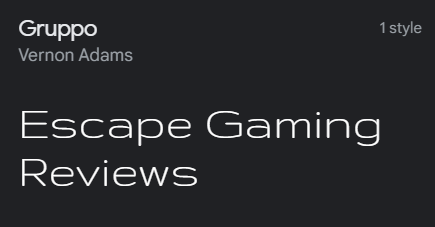

# Escape Gaming Reviews
## Milestone Project 3:  *Deminstration of Backend Development understand, through a gaming review site.* 

DISCLAIMER: This is a project for Code Institute, to demonstrate understanding of Backend Development, and not for finacial gain. 

# SCRENSHOT HERE!

## Live Project 

[View live project here](https://game-review.herokuapp.com/)

## Repository 

[Locate project repository here](https://github.com/JJBR13/Justin-Brown-milestone-project-3)

## Contents 

- [Ideology](#ideology)
- [User Experience](#user-eperience)
    + [User Stories](#user-stroies)
- [Design](#design)
    + [Wireframes](#wireframes)
    + [Colour Palette](#colour-palette)
    + [Typography](#typography)
- [Current Features](#current-features)
    + [Responsive On All Devices](#responsive-on-all-devices)
- [Future Releases](#future-releases)
- [Languages Used](#languages-used)
- [Testing](#testing)
- [Deployment](#depolyment)
    + [Project Creation](#project-creation)
    + [GitHub Pages](#github-pages)
    + [Local Deployment](#local-deployment)
- [References, Credit, Framework & Programs](#references-credit-framework--programs)
    + [References](#references)
    + [Credit](#credit)
    + [Framework](#framework)
    + [Programs](#programs)

## Ideology

The idea behind this website demonstrates 'CRUD' functionality. This site allows the user to browse game reviews from other gamers, allowing the user to gain a better understanding and knowledge before purchasing the game themselves. 

## User Experience 

### User Stories 

### The First Time User 

* Being a first-time user, I want an easy-navigating site. 
* Being a first-time user, I want the sign-up process to be smooth and available.
* Being a first-time user, I want to be able to search existing reviews.
* Being a first-time user, I want to see a clear business & brand identity. 

### The Regular User

* Being a Regular user, I want the login button easily accessible.
* Being a Regular user, I want to be able to add new reviews easily.
* Being a Regular user, I want to be able to edit my reviews in case of typo.
* Being a Regular user, I want to be able to delete my reviews.
* Being a Regular user, I want would like to search other gamers' reviews. 
* Being a Regular user, I want like to contact the admin if I encounter any issues.

## Design 

### Wireframes

[Click here for Wireframe PDF](#!)

### Colour Pallete

- To generate the feeling of the gaming community the site took inspiration from the RGB keyboard backlight. Along with fresh neutral colors to keep the sire inviting. 

### Typography

[*Sourced via google fonts.*](https://fonts.google.com/)

- Header font: Syne Mono 

- Content font: Gruppo

## Current Features

### Favicon 

### Banner 

### Navbar

### Pages 

#### Home 

#### Reviews

#### Contact 

#### Sign Up

#### Account 

#### Login 

#### 404 Error page

### Logout functionality

### Add review

### Edit Review 

### Delete Review 

### Footer 

### Other Features 

- Back to top button 

## Future Release

## References, Credit, Frameworks & Programs

### References

- [MongoDB](https://www.mongodb.com/): 
    - The project database is stored in MongoDB.

- [Git](https://git-scm.com/): 
    - Used for version conterol.

- [GitHub](https://docs.github.com/en/get-started): 
    - Was used to store the project.

- [Google Chrome Developer Tools](https://developer.chrome.com/docs/devtools/): 
    - Used to inspect site pages and there elements to help debug issues with layouts and try differnt CSS styles.

- [Canva.com](https://www.canva.com/colors/color-palettes/sweet-succulents/)
    - Used to gauge simplistic pallets for design.

- [Fotor](https://www.fotor.com/design/project/cdc12d1d-ad35-48ac-8e90-24a5eeea1f81/template)
    - Used to create the header banner.  

- [Hex to RGBA Converter](https://rgbacolorpicker.com/)
    - Used to convert hex to rgba.

- [Google Fonts](https://fonts.google.com/) 
    - Used to import fonts into style.css. 

- [Font Awesome](https://fontawesome.com/): 
    - All icons used for the site.

### Credit 

- [stack Overflow](https://stackoverflow.com/questions/50687845/jinja-how-to-force-truncate-when-value-exceeds-specified-field-width)
    - Code taken for truncate function. 

- [Steam & Steam users](https://store.steampowered.com/)
    - Pull review content from users about certain games.

- [w3school](https://www.w3schools.com/howto/howto_js_scroll_to_top.asp): 
    - Back to top button js function code.
    
### Frameworks 

- [Pymongo](https://pypi.org/project/pymongo/): 
    - Used as the Python API for MongoDB, to link to fronend aplication. 

- [Flask](https://flask.palletsprojects.com/en/1.1.x/): 
    - Through out the project Flask is used, which is a Python Microframework. 

- [Jinja](https://jinja.palletsprojects.com/en/3.0.x/): 
    - In addition with Flask in HTML code. Enables simple linking between frontend and backend.

- [Heroku](https://id.heroku.com/login): 
    - Used as hosting platform to deploy the project.

- [Werkzeug](https://werkzeug.palletsprojects.com/en/2.0.x/): 
    - To secure user password through hashing.

- [Materialize](https://materializecss.com/): 
    - Was the framework used for the structure of the whole site. 

- [jquery](https://releases.jquery.com/) 
    - Used to aid alongside Materialize, for interactive elements. 

### Programs 

- [Balsamiq](https://balsamiq.com/)
   - Allowed the creation of the wireframes.

- [Adobe Suite](https://www.adobe.com/uk/)
  - Used to crop, adjust and scale images. 