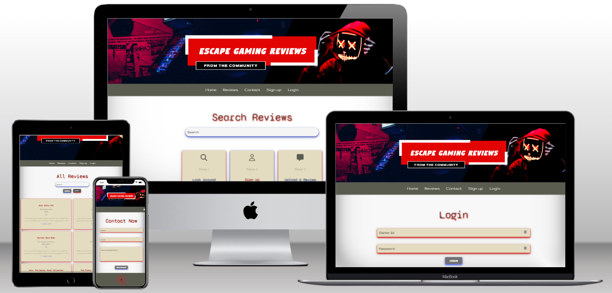

# Escape Gaming Reviews
## Milestone Project 3:  *Demonstration of Backend Development understanding, through a gaming review site.* 

DISCLAIMER: This is a project for Code Institute, to demonstrate an understanding of Backend Development and not financialise gain. 

## Live Project 

[View live project here](https://game-review.herokuapp.com/)

## Repository 

[Locate project repository here](https://github.com/JJBR13/Justin-Brown-milestone-project-3)

## Contents 

- [Ideology](#ideology)
- [User Experience](#user-experience)
    + [User Stories](#user-stories)
- [Design](#design)
    + [Wireframes](#wireframes)
    + [Colour Palette](#colour-pallete)
    + [Typography](#typography)
- [Current Features](#current-features)
    + [Responsive On All Devices](#responsive-on-all-devices)
- [Future Releases](#future-releases)
- [Languages Used](#languages-used)
- [Testing](#testing)
- [Deployment](#deployment)
    + [Project Creation](#project-creation)
    + [Heroku](#heroku)
    + [Local Deployment](#local-deployment)
- [References, Credit, Frameworks & Programs](#references-credit-frameworks-programs)
    + [References](#references)
    + [Credit](#credit)
    + [Frameworks](#frameworks)
    + [Programs](#programs)

## Ideology

The idea behind this website demonstrates 'CRUD' functionality. This site allows the user to browse game reviews from other gamers, allowing the user to gain a better understanding and knowledge before purchasing the game themselves. 

## User Experience 

### User Stories 

### The First Time User 

* Being a first-time user, I want an easy-navigating site. 
* Being a first-time user, I want the sign-up process to be smooth and available.
* Being a first-time user, I want to be able to search existing reviews.
* Being a first-time user, I want to see a clear business & brand identity. 
* Being a first-time user, I want to be able to add my first review. 

### The Regular User

* Being a Regular user, I want the login page easily accessible.
* Being a Regular user, I want a logout feature to secure my profile.
* Being a Regular user, I want to be able to add new reviews easily.
* Being a Regular user, I want to be able to edit my reviews in case of typos.
* Being a Regular user, I want to be able to delete my reviews.
* Being a Regular user, I would like to search and view other gamers' reviews. 
* Being a Regular user, I want like to contact the admin if I encounter any issues.
* Being a Regular user, I want to use the service on multiple devices. 

## Design 

### Wireframes

[Click here for Wireframe PDF](documents/wireframes.pdf)

### Colour Pallete

- To generate the feeling of the gaming community the site took inspiration from the RGB keyboard backlight. Along with fresh neutral colors to keep the sire inviting. 

### Typography

[*Sourced via google fonts.*](https://fonts.google.com/)

- Header font: Syne Mono 

- Content font: Gruppo

## Current Features

### Favicon 

-  A site-wide favicon of the site logo was created, this allows the user to easily identify the site when multiple are open. Helping to achieve user stories:

> i. Being a first-time user, I want an easy-navigating site.
> ii Being a first-time user, I want to see a clear business & brand identity.

### Banner 

- Throughout the whole site located in the header, is a banner. This purpose is to create a modern feel and provide consistency site-wide. Further aiding user stories:

> i. Being a first-time user, I want an easy-navigating site.
> ii Being a first-time user, I want to see a clear business & brand identity.

### Navbar

- A Navbar is located site-wide, in the same fashion on all pages, it contains a dropdown menu for additional pages when the user is logged in. On mobile it collapses into a burger menu, allowing the user to access the site on a range of devices. Complying with user stories:

> i. Being a first-time user, I want an easy-navigating site.
> ii. Being a Regular user, I want to use the service on multiple devices. 

### Pages 

#### Home 

- Landing on the site this is the first page the user see's the user has minimal page access, (home, reviews, contact, sign up and login). The body of the page displays a search bar, this allows any user signed up or not to browse all game reviews on the site. Creating user relevance: 

> i. Being a first-time user, I want an easy-navigating site. 
> ii. Being a first-time user, I want to be able to search existing reviews.
> iii. Being a Regular user, I would like to search and view other gamers' reviews.  

#### Reviews

- This displays all reviews from the database from all users. Located on each review is a read more button, which enables the reader to read the review in its entirety. After you have read the review there are buttons to go back to reviews or back to the top to read elements of the review again. This encapsulates user stories: 

> i. Being a first-time user, I want an easy-navigating site.
> ii. Being a Regular user, I would like to search and view other gamers' reviews. 

#### Contact 

- This page displays a simple contact form for the user to fill out if they ever have an issue, to get in contact with admin to resolve it, using email.js functionality. Achieving user story: 

> i. Being a Regular user, I want like to contact the admin if I encounter any issues.

#### Sign Up

- This is where a new user can sign up to start contributing reviews. They have to complete the form. The feature of this form, create a gamer id, if it already exists a message displays explaining the issue and comes up with a new gamer id. 

- When the user has a unique gamer id and has entered their desired password. They will be directed to their account page, displaying a message at the top of the page saying registration is successful. Acheving user stories:

> i. Being a first-time user, I want the sign-up process to be smooth and available.

#### Login 

- Displays a simple form input, the user has to input their gamer id and password, and this then gets checked against the database. Of the user is correct and the password matches the user is logged on and redirected to their account page. Once login is complete this allows the user to see the dropdown feature in the header element displaying: the account, add a review and logout Achieving user stories: 

> i. Being a Regular user, I want the login page easily accessible.
> ii. Being a Regular user, I want to be able to add new reviews easily.

#### Account 

- After signing up the user gets redirected to this page, once here they can start adding reviews from the new dropdown feature in the navbar. 

- If you are a returning user, then has already generated reviews you can see all your reviews on this page, and allows you to edit, delete and create further reviews. Helping improve user stories:

> i. Being a first-time user, I want to be able to add my first review.
> ii. Being a Regular user, I want to be able to add new reviews easily.
> iii. Being a Regular user, I want to be able to edit my reviews in case of typos.
> iV. Being a Regular user, I want to be able to delete my reviews.

#### 404/505 Error page

- This error page will display when the user clicks on a page that no longer exists and redirect the user via a button to the home page. Aiding to user story: 

> i. Being a first-time user, I want an easy-navigating site. 

### Logout functionality

- Once a user is logged in the dropdown menu displays the logout button. This allows the user to end their session and returns them to the home page with a relevant message of completion. 

> i. Being a Regular user, I want a logout feature to secure my profile.

### Add review

- This page is displayed when the user is logged in. A form to fill out with content about the game the user is reviewing: game name, select console, choose a category, and review content. With a submit review button that will post your review to the site. Once the review is submitted, it redirects the user to the home page, with a relevant message of success. This backs up the user story: 

> i. Being a Regular user, I want to be able to add new reviews easily.

### Edit/ Delete Review 

- When on the account page you can see reviews made by the user in session. Here is an edit and delete button show, this therefore only allows the user to edit and delete the reviews they have created. 

- The edit button redirects the user to the desired review, pre-populated with the review information. There is a cancel and save button. The cancel button takes the user back to the account page, without any changes to the review. The save button saves any new changes and also redirects to the account page, with a relevant message saying it has been achieved. 

- If the delete button is pressed, a module pops up and asks the user if they are sure they want to delete the review. To buttons display, cancel, and delete. Both these buttons redirect to the account page, however when the user presses the delete button it displays a message confirming the deletion. 

Achieving user stories: 
> i. Being a Regular user, I want to be able to edit my reviews in case of typos.
> ii. Being a Regular user, I want to be able to delete my reviews.

### Footer 

- Site-Wide is a footer this includes copywriting information. likes to all site pages and the company's logo, which when clicked takes the user to the home page. This enhances user stories: 

> i. Being a first-time user, I want an easy-navigating site.
> ii. Being a first-time user, I want to see a clear business & brand identity. 

### Other Features 

- This feature is located after clicking the read more link on the reviews. It allows the user after reading the review to go back to the top. 

### Responsive On All Devices

- Escape Gaming Reviews, is made easily accessible on all devices with help from the Materialize framework. Test through Google Developer Tools, on devices: 
    - iPhone SE
    - iPhone XR
    - Pixel 5
    - Samsung S8+
    - iPad Mini
    - iPad Air 

- The site was also tested for full responsive functionality manually on the below devices: 
    - Razor Blade 15 
    - Galaxy Fold Z3
    - ASUS ZenScreen 

- Enabling the site to function seamlessly across a range of devices, coincides with the user story: 

> i. Being a Regular user, I want to use the service on multiple devices. 

## Future Releases

### 1) Create Admin Account

- This would allow the admin to monitor reviews and remove & message users that have inappropriate reviews on the site. 

### 2) Filter Buttons

- Located on both review and home pages. That allows quick and easy filtering through reviews by game category type or the console it is played on. 

### 3) Display Message: sign up and login functions 

- When the user is signing up or login in and the username is incorrect it would be good to have a message under the input field in read text displaying: "game id, have to be 6 characters long and only use the special character ($!&)". 

### 4) Session Expiry 

- A feature that automatically logout the user in a certain length of inactivity. 

### 5) Image Upload Feature 

- Allow the user to upload images to their reviews and profile. 

### 6) Close Icon: flash message

- A close "x" on the flash message to remove them from the site manually in the user no longer wants it. 

### 7) Add Category

- Allow the user to add new categories to the database when adding a review or editing a review.

## Languages Used

- [HTML5](https://www.w3schools.com/whatis/whatis_html.asp)
- [CSS3](https://www.w3schools.com/whatis/whatis_css.asp)
- [JavaScript](https://www.w3schools.com/whatis/whatis_js.asp)
- [Python](https://www.python.org/doc/)

## Testing

- Please see [TEST.md](TEST.md) for a breakdown of website testing and debugging.

## Deployment

### Project Creation

- This project was created through GitHub: 
 1. Locating repository, clicking on the "New" button.
 2. Selecting the relevant template:  "Code-Institute-Org/gitpod-full-template" 
 3. Adding the repository name "JJustin-Brown-milestone-project-two".
 4. Clicking the button "Create repository". 

- Adding the Chrome extension "GitPod" created an online coding platform, enabling the use of bash terminals throughout the project. The below "git commands" were used: 

1. git add . - This command for multiple files to the staging area before commiting. 
2. git commit -m "Message explaining upadate" - This command explained changes that were done to the repository. 
3. git push - This command was used to push all committed changes to the GitHub Repository. 

### Heroku

- To deploy project live in Heroku the following steps were taken: 

1. Go to [Heroku Web app](https://dashboard.heroku.com/apps) 
2. Click the new button
3. Select create a new app 
4. Create a name
5. Select the location
6. Press create an app

#### Connect Heroku to GitHub

1. Click the deploy tab, and select GitHub. Connect to GitHub. 
2. Type repository into the search bar
3. Once the repository has been found, click the connect button. 

#### Set Environment Variables 
1. Click the setting tab and click the Reveal Config vars button. 
2. Add the following information: 
    - key: IP, value: 0.0.0.0
    - key: PORT, value: 5000
    - key: MONGO_DBNAME, value: (database name you want to connect to)
    - key: MONGO_URI, value: (located in MongoDb  by going to cluster --> connect --> connect to application, and copying the  
      link adding in your database name and password)
    - key: SECRET_KEY, value: (this is a custom secrete key set up for configuration to keep user sessions secure)

#### Activate Automatic Deployment
1. Click the Deploy tab.
2. In the automatic deploys section, select the branch you want to deploy. 
3. Select Enable Automation.

### Local Deployment

1. Navigate to the [Github](https://github.com/JJBR13/Justin-Brown-milestone-project-two).
2. Click the "Code" dropdown button. 
3. Select "Download ZIP" or " Open with GitHub Desktop"
4. Unpackage the ZIP file locally with Integrated Development Environment (IDE).
5. Get env.py variables: 
    - key: IP, value: 0.0.0.0
    - key: PORT, value: 5000
    - key: MONGO_DBNAME, value: (database name)
    - key: MONGO_URI, value: (located in MongoDb  by going to cluster --> connect --> connect to application, and copying the  
      link adding in your database name and password)
    - key: SECRET_KEY, value: (this is a custom secrete key set up for configuration to keep user sessions secure)

## References, Credit, Frameworks & Programs

### References

- [MongoDB](https://www.mongodb.com/): 
    - The project database is stored in MongoDB.

- [Git](https://git-scm.com/): 
    - Used for version conterol.

- [GitHub](https://docs.github.com/en/get-started): 
    - Was used to store the project.

- [RandomKeygen](https://randomkeygen.com/)
    - used to generated a random secrete key.

- [Google Chrome Developer Tools](https://developer.chrome.com/docs/devtools/): 
    - Used to inspect site pages and there elements to help debug issues with layouts and try differnt CSS styles.

- [Canva.com](https://www.canva.com/colors/color-palettes/sweet-succulents/)
    - Used to gauge simplistic pallets for design.

- [Fotor](https://www.fotor.com/design/project/cdc12d1d-ad35-48ac-8e90-24a5eeea1f81/template)
    - Used to create the header banner.  

- [Hex to RGBA Converter](https://rgbacolorpicker.com/)
    - Used to convert hex to rgba.

- [Google Fonts](https://fonts.google.com/) 
    - Used to import fonts into style.css. 

- [Font Awesome](https://fontawesome.com/): 
    - All icons used for the site.

- [Emailjs](https://www.emailjs.com/): 
    - Used for a contact form on contact.html

- [Converto](https://convertio.co/): 
    - Used to convert banner from PNG to WEBP format.

- [Techsini](https://techsini.com/multi-mockup/index.php): 
    - Created mockups from the live site.

### Credit 

- [stack Overflow](https://stackoverflow.com/questions/50687845/jinja-how-to-force-truncate-when-value-exceeds-specified-field-width)
    - Code taken for truncate function. 

- [Steam & Steam users](https://store.steampowered.com/)
    - Pull review content from users about certain games.

- [Mozilla](https://developer.mozilla.org/en-US/docs/Web/API/Window/scrollTo): 
    - Back to top button js function code.

- [Jeffrey Martinez](https://martinezjf2.medium.com/how-to-setup-emailjs-33809350f0f8)
    - Blog used to help initialize email.js

[Code Institute](https://codeinstitute.net/): 
    - For all the lecture/ learning content provided. 
    
### Frameworks 

- [Pymongo](https://pypi.org/project/pymongo/): 
    - Used as the Python API for MongoDB, to link to fronend aplication. 

- [Flask](https://flask.palletsprojects.com/en/1.1.x/): 
    - Through out the project Flask is used, which is a Python Microframework. 

- [Jinja](https://jinja.palletsprojects.com/en/3.0.x/): 
    - In addition with Flask in HTML code. Enables simple linking between frontend and backend.

- [Heroku](https://id.heroku.com/login): 
    - Used as hosting platform to deploy the project.

- [Werkzeug](https://werkzeug.palletsprojects.com/en/2.0.x/): 
    - To secure user password through hashing.

- [Materialize](https://materializecss.com/): 
    - Was the framework used for the structure of the whole site. 

- [jquery](https://releases.jquery.com/) 
    - Used to aid alongside Materialize, for interactive elements. 

### Programs 

- [Balsamiq](https://balsamiq.com/)
   - Allowed the creation of wireframes.

- [Adobe Suite](https://www.adobe.com/uk/)
  - Used to crop, adjust and scale images. 