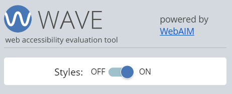
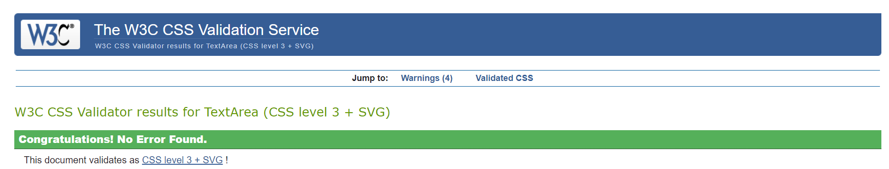
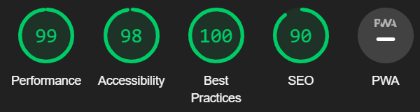
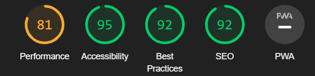
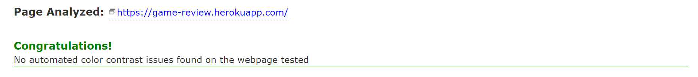

# Testing 

Testing was done site-wide, all tests undertaken are shown below: 

## Contents 

- [Functional Testing](#functional-testing)
- [WAVE](#wave)
- [Validator Testing](#validator-testing)
  + [HTML](#html)
  + [CSS](#CSS)
  + [JavaScript](#javascript)
  + [PEP8](#pep8-online)
- [Lighthouse](#lighthouse)
  + [Desktop Results](#desktop-results)
  + [Mobile Results](#mobile-results)
- [Colour Contrast](#colour-contrast)
- [Browser Compatibility](#browser-compatibility)
- [Responsivity](#responsivity)
- [Issues/ Bugs Found & Resolved](#issues-bugs-found-resolved)

## Functional Testing 

### 1. 

Description: 

Ensure the user can navigate the header & footer NAV-BAR

Steps: 

I. Click Reviews 
II. Redirect to Reviews.  
III. Repeat for Home, Sign up, Login, Contact, Account, and Add Review pages  
IV. Repeat all steps on all pages

Expected: 

NAV-BAR heading links the user to relevant pages.

Outcome: 

NAV-BAR heading link the user to relevant pages. 

## 2. 

Description: 

Ensure the footer logo links to home

Steps: 

I. Click the logo in the footer 
II. Redirect to the home page 

Expected: 

Logo Redirect to Home page. 

Outcome: 

Logo when clicked links the user back to the home page. 

### 3. 

Description: 

Copywrite text, links to GitHub repositories

Steps: 

I. Click Copywrite text 
II. Redirect to GitHub repositories. 

Expected: 

Copywrite text links to repositories.

Outcome: 

When clicking links to Github repositories. 

### 4.

Description: 

Search bar function

Steps: 

I. Enter desired search input  
II. Filter reviews for keywords within review content & title  
III. Display reviews with search results. 

Expected: 

Display all reviews with search input.

Outcome: 

Shows all reviews with users desired input. 

### 5.

Description: 

Search button, activate a search.

Steps: 

I. Click the search button after input is entered 
II. Activates search on the database. 

Expected: 

The button activates the search.

Outcome: 

When clicked button generates a search of the database. 

### 6. 

Description: 

The reset button resets the search.

Steps: 

I. Click reset button 
II. Clears search & returns all reviews. 

Expected: 

Clear prior search results and display all reviews.

Outcome: 

When clicked reset the search shows all reviews in the database. 

### 7.

Description: 

Press the read more link on review content.

Steps: 

I. Click read more link 
II. Displays the whole review and all content. 

Expected: 

To redirect the user to read the review entirely.

Outcome: 

Shows user all review content.

### 8.

Description: 

Back to top button, scroll to top of review.

Steps: 

I. Scroll through the review to the bottom. 
II. Click the back to the top, button. 
III. Takes you back to the top of the review.

Expected: 

Smoothly auto-scroll the user to the top of the review.

Outcome: 

Auto-scroll the user seamlessly to the top of the review.

### 9.

Description: 

Press the back button, to return the user to the review page. 

Steps: 

I. User scrolls to the bottom of the review after reading the content. 
II. Press the back button to return to view all reviews.

Expected: 

To return the user to All reviews. 

Outcome: 

Returns the user to the reviews page, able to view all reviews. 

### 10.

Description: 

Send button on the contact form, sends the form to admin. 

Steps: 

I. Fill out required form input fields 
II. Click send message button. 
III. Sends for & displays thank you a message to the user. 
IV. Page auto reloads after 3 seconds.

Expected: 

Form sent, and displays thank you a message, reloading the page after three seconds. 

Outcome: 

Sends form, displays relevant, message, and reloads the page after three seconds. 

### 11.

Description: 

Sign up submit button registers a new user to the database. 

Steps: 

I. Fill out the sign up form. 
II. Press submit button. 
III. Redirects user to account page. 
IV. Flash message displays.

Expected: 

Inputs new user details into the database. Redirecting them to the new account page, with a relevant success message. 

Outcome: 

Creates a new user on the database, redirects the user to the account page, and displays relevant flash message. 

### 12.

Description: 

Have an account? The button takes the user to the login page.

Steps: 

I. Click the button link. 
II. Redirects user to login page 

Expected: 

Take the user to the login page. 

Outcome: 

The user gets redirected to the login page. 

### 13. 

Description: 

Review now button, allows user to create thier first review.

Steps: 

I. Click review now. 
II. Redirects user to add a review. 

Expected: 

Takes the user to be able to add a review.

Outcome: 

Takes user to add review page. 

### 14. 

Description: 

Logout button logs user out of account.

Steps: 

I. Click the Logout link. 
II. Logs user out of account. 
III. Redirects user home page. 
IV. Flash message displays.

Expected: 

Logs out user, redirecting them to the home page, where the "see you soon" message is displayed.

Outcome: 

The user gets redirected to the home page with a relevant flash message displayed.

### 15.

Description: 

Need to sign up? The button takes the user to the sign up page.

Steps: 

I. Click the button link. 
II. Redirects user to sign up page 

Expected: 

Take the user to the sign up page. 

Outcome: 

The user gets redirected to the sign up page. 

### 16. 

Description: 

The edit button takes the user to edit the review. 

Steps: 

I. Click the button 
II. Redirects user to edit page 

Expected: 

Takes the user to view their review.

Outcome: 

The user is taken to the edit review page, to edit their desired review. 

### 17.

Description: 

Edit save button, updates review, and redirects the user back to the account page.

Steps: 

I. Click the button. 
II. Save the changed review to the database. 
III. Redirects the user back to the account page. 

Expected: 

Updates users desired reviews and save them to the database.

Outcome: 

Updates the user reviews and redirects the user back to their account.

### 18. (NEED TO MAKE WORK!!!)

Description: 

The cancel button allows the user to return to the account page without editing their review.

Steps: 

I. Click the button. 
II. Redirects user to the account page. 

Expected: 

Redirects user to account page without making any changes to the review.

Outcome: 

The user does not have to change the review and redirect the user back to their account. 

### 19. 

Description: 

The delete button activates the delete modal.

Steps: 

I. Click the button. 
II. Brings up modal. 

Expected: 

The button brings up a modal, making sure the user wants to delete the review. 

Outcome: 

The delete button brings up a modal, making sure the user is sure they want to delete the review. 

### 20. 

Description: 

The modal delete button confirms deletion and removes the review from the database.

Steps: 

I. Click the button. 
II. Deletes review from the database. 
III. Redirects to the account page, with relevant a flash message.

Expected: 

The delete button removes the review from the database and takes the user back to their account page.

Outcome: 

The button deletes the review, and it the takes user back to the account page with a flash message. 

### 21. 

Description: 

The modal cancel button stops the user from having to delete the review. 

Steps: 

I. Click the button. 
II. Bring the user back to their account page. 

Expected: 

Remove the modal and redirect the user back to their account page.

Outcome: 

The button removes the modal and redirects the user to their account page.

## WAVE

[WAVE link](https://wave.webaim.org/)

- This Chrome extension was used throughout the build of the site as well as final testing, this was to minimize bugs at the end of the project's final testing. 

## Validator Testing

### HTML

[W3C HTML Validator link](https://validator.w3.org/)

- All .html files were validated through this checker, highlighting issues such as: 
  - Redundant tags 
  - Missing tags 
  - "POST" method in div tags, not for tags

- This was brilliant, to find these issues, however, due to the use of Jinji templating and url_for for href links, these tests were never completely clear. 

### CSS

[W3C CSS Validator link](https://jigsaw.w3.org/css-validator/#validate_by_input+with_options)

- This test returned no issues. 

## JavaScript

[JSHint](https://jshint.com/)

- Both files were Tested, they highlighted minimal issues and pulled errors with the Materialize script.

## PEP8 Online

[PEP8](http://ww7.pep8online.com/)

- This validation tested python code, in the app.py and was used throughout the development giving key indications of what was not compliant and the reason for this. This helped keep the code clean and readable throughout the development.

## Lighthouse 

[Lighthouse](https://developer.chrome.com/docs/lighthouse/)

- Lighthouse gave a lot of insight into the functionality and interpretation of the site. This test highlighted the main issue was the image load. This was dues to image files being too big, which led to the compression of all .png files and changing the format to webp. This helped increase the scores tremendously. 

- There was a considerable drop in performance on phone. This leads to a media query being generated for the banner. However, on inspections of prompts it gave, were dues to imported libraries from Materialize.

### Desktop Results

### Mobile Results

## Colour Contrast 

[A11y Color link](https://color.a11y.com/)

## Browser Compatibility 

- This site was tested on Chrome, Microsoft Edge, and Firefox on desktop.

- The website was tested in Chrome on mobile and tablet. 

- All tested devices were consistent across browsers.

## Responsivity

- Escape Gaming Reviews, is made easily accessible on all devices with help from the Materialize framework. Test through Google Developer Tools, on devices: 
    - iPhone SE
    - iPhone XR
    - Pixel 5
    - Samsung S8+
    - iPad Mini
    - iPad Air 

- The site was also tested for full responsive functionality manually on the below devices: 
    - Razor Blade 15 
    - Galaxy Fold Z3
    - ASUS ZenScreen 

## Issues/ Bugs Found & Resolved

### a)

- The first bug encountered was with the app route /sign_up, the function worked until after pressing the submit button. The new user was being uploaded to the database but not redirected to the correct place. 

    - This was fixed after a typo was corrected to the collection name: gamerId should have been gamer_id.

### b)

- This was due to not having labels on my form element inputs, which caused WAVE to highlight an error. 
    
    - It was resolved by simply putting label attributes form input fields.

### c) 

- When viewing the site on mobile devices it was clear that all pages were visible to the user. 

    - This was fixed by adding the same Jinja templating from the main navbar to the mobile navbar.

### d)

- App.route edit_reviews, was not POST-ing the changes to the database. 

  - This was fixed by using the [$set](https://www.mongodb.com/docs/manual/reference/operator/update/set/) operator. 

### e) 

- Connect Emailjs to contact form, was throwing a POST 404 error. 

    - This was fixed by using vanilla JavaScript and getting the correct order for importing the API.

Back to [README.md](/README.md)